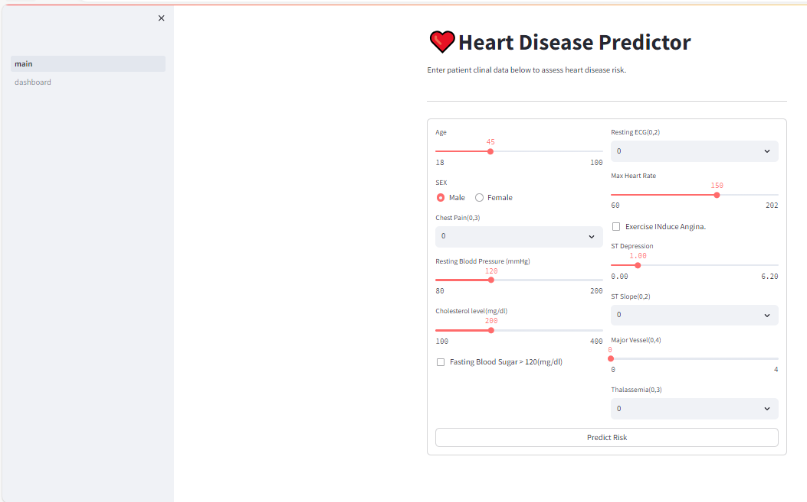
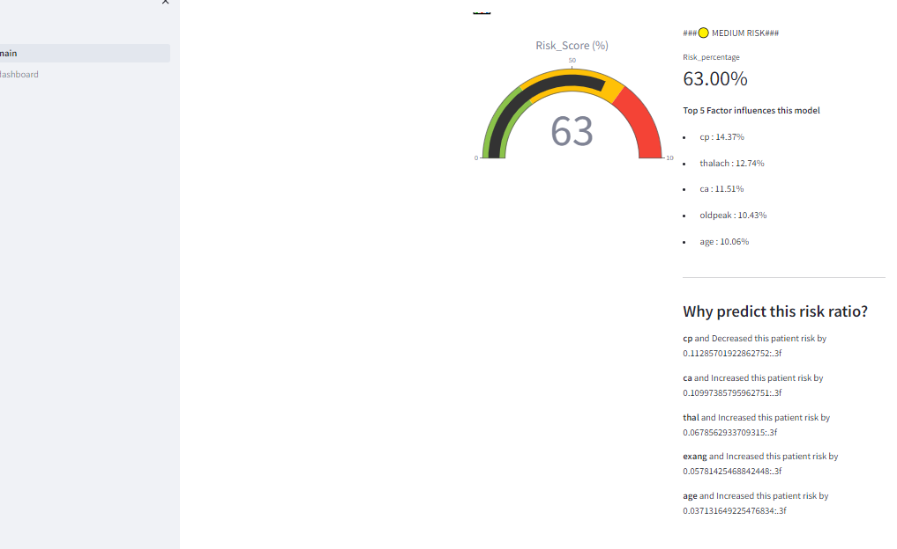
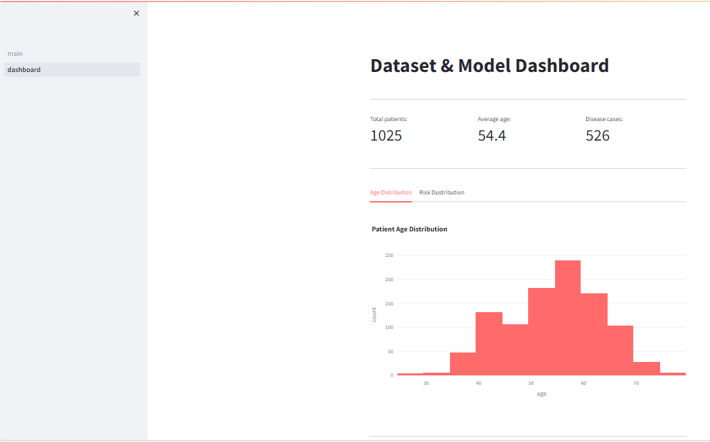

# ❤️ Heart Disease Risk Predictor

An end-to-end machine learning web application that predicts cardiovascular disease risk from clinical patient data, built with Python, Scikit-learn, and Streamlit — with a focus on explainability, not just prediction.

[Add your live demo link here once deployed]

---

## 📸 Screenshots

<!-- Replace these with your actual screenshots. Suggested shots:
1. The prediction form (patient input)
2. The risk gauge + result
3. The "Why This Specific Prediction?" SHAP explanation section
4. The Dashboard page
-->

| Prediction Form | Risk Result & Explanation |
|---|---|
|  |  |

| Dashboard |
|---|
|  |

---

## 🚀 Features

- **Interactive prediction form** — enter 13 clinical measurements and get an instant risk assessment
- **Visual risk gauge** — color-coded Low/Medium/High risk indicator built with Plotly
- **Global feature importance** — see which factors matter most across the entire model
- **Per-patient explainability (SHAP)** — for each individual prediction, see exactly which features pushed that specific patient's risk up or down, and by how much
- **Dataset dashboard** — overview of the training data: age distribution, class balance, and model performance metrics
- **Full ML pipeline built from scratch** — custom preprocessing, scaling, and training modules, not just a notebook

---

## 🛠️ Tech Stack

- **Language:** Python 3
- **Web Framework:** Streamlit
- **Machine Learning:** Scikit-learn (Random Forest Classifier)
- **Explainability:** SHAP (SHapley Additive exPlanations)
- **Data Handling:** Pandas, NumPy
- **Visualization:** Plotly
- **Model Persistence:** Joblib
- **Version Control:** Git & GitHub

---

## 📊 Dataset

- **Source:** [Heart Disease Dataset (Kaggle)](https://www.kaggle.com/datasets/johnsmith88/heart-disease-dataset)
- **Records:** 1,025 patients
- **Features:** 13 clinical attributes
- **Target:** Presence of heart disease (0 = No, 1 = Yes)
- **Class balance:** ~51% / 49% (no class imbalance handling required)

### Clinical Features Used

| Feature | Description |
|---|---|
| age | Age in years |
| sex | Sex (1 = male, 0 = female) |
| cp | Chest pain type |
| trestbps | Resting blood pressure (mmHg) |
| chol | Serum cholesterol (mg/dl) |
| fbs | Fasting blood sugar > 120 mg/dl |
| restecg | Resting electrocardiographic results |
| thalach | Maximum heart rate achieved |
| exang | Exercise induced angina |
| oldpeak | ST depression induced by exercise |
| slope | Slope of the peak exercise ST segment |
| ca | Number of major vessels colored by fluoroscopy |
| thal | Thalassemia type |

---

## 📁 Project Structure

```
heart-disease-predictor/
├── app/
│   ├── config.py                # App configuration & constants
│   ├── main.py                  # Streamlit entry point (prediction UI)
│   ├── pages/
│   │   └── 1_dashboard.py       # Dataset & model insights page
│   └── models/
│       ├── preprocessing.py     # Data loading, splitting, scaling
│       ├── train_model.py       # Model training pipeline
│       └── predictor.py         # Loads model, makes predictions + SHAP explanations
├── data/
│   └── raw/
│       └── heart_disease.csv
├── models/
│   ├── trained_model.pkl        # Saved Random Forest model
│   └── scaler.pkl               # Saved StandardScaler
├── .streamlit/
│   └── config.toml
├── requirements.txt
└── README.md
```

---

## ⚙️ Installation & Setup

1. **Clone the repository**
   ```bash
   git clone https://github.com/saad-abbasi01/heart-disease-predictor.git
   cd heart-disease-predictor
   ```

2. **Create and activate a virtual environment**
   ```bash
   python -m venv venv
   venv\Scripts\activate      # Windows
   source venv/bin/activate   # Mac/Linux
   ```

3. **Install dependencies**
   ```bash
   pip install -r requirements.txt
   ```

4. **Run the app**
   ```bash
   streamlit run app/main.py
   ```

---

## 🧠 The ML Pipeline

```bash
python app/models/preprocessing.py   # test the preprocessing pipeline standalone
python app/models/train_model.py     # retrain the model from scratch
```

**Pipeline steps:**
1. Load raw CSV data and validate (check for missing values)
2. Split into 13 features (X) and target (y)
3. Stratified 70/30 train/test split (preserves class balance)
4. Scale features with `StandardScaler` — fit **only** on training data, applied to test data (to avoid data leakage)
5. Train a `RandomForestClassifier` (100 trees, max depth 10)
6. Evaluate on the held-out test set
7. Save the trained model and scaler with `joblib`

---

## 📈 Model Performance

| Metric | Score |
|---|---|
| Accuracy | 99% |
| Precision | 100% |
| Recall | 98% |
| F1-Score | 99% |

### ⚠️ A Note on These Numbers

These metrics are unusually high, and I investigated why instead of taking them at face value. The Kaggle dataset used here is a known augmented/duplicated version of the smaller original UCI Cleveland dataset (~300 unique patients) — meaning some patients effectively appear in both the training and test sets in slightly different forms, inflating accuracy.

**This is a dataset quality issue, not a bug in the pipeline itself.** A more realistic accuracy for this type of model on the original, deduplicated data is typically closer to **80-85%**. Addressing this (via deduplication or switching to the original UCI dataset) is listed under Future Improvements below.

---

## 🔍 Explainability: Why This Project Goes Beyond a Basic Model

Most beginner ML projects stop at "here's a prediction." This one answers two levels of *why*:

- **Global explainability** — using scikit-learn's built-in `feature_importances_`, the app shows which features matter most *across the entire model*.
- **Local explainability (SHAP)** — using `shap.TreeExplainer`, the app calculates, for *this specific patient*, exactly how much each feature pushed their individual risk score up or down. This is a meaningfully more rigorous and clinically useful explanation than global importance alone.

---

## 🎯 Future Improvements

- [ ] Deduplicate the dataset (or switch to original UCI data) for a more realistic accuracy figure
- [ ] Add cross-validation instead of a single train/test split
- [ ] Hyperparameter tuning with GridSearchCV
- [ ] Containerize with Docker for consistent deployment
- [ ] Deploy live (Streamlit Community Cloud)
- [ ] Add unit tests for the preprocessing and prediction pipeline

---

## ⚠️ Disclaimer

This project is built for **educational purposes only**. It is **not** a medical diagnostic tool and should never be used as a substitute for professional medical advice.

---

## 👨‍💻 Author

**Saad Abbasi**
BSCS Student, Government College University Faisalabad (GCUF) | Data Science & ML
[GitHub](https://github.com/saad-abbasi01) · [LinkedIn](https://www.linkedin.com/in/saad-abbasi-821090428)

---

## 📝 License

This project is open source and available under the MIT License.